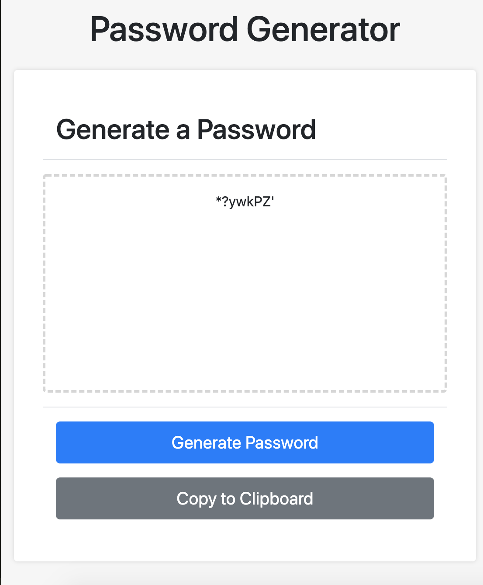

# Unit 03 JavaScript Homework: Password Generator

## Description

The purpose of this assignment is to generate a password based on user preferences within pre-existing parameters.

The user chooses the number of characters they would prefer their password to contain. They are allowed between 8 and 128 characters. If they enter a number outside of these set characters, the page will prompt them until they are set within.

Then a user confirms what type of characters they want. They can choose from these types:

* Special characters
* Uppercase characters
* Lowercase characters
* Numeric characters

One of these types is required. If they don't choose any, then the page will cycle through them again until they choose at least one.

With the user preferences set, the page runs through methods based on these choices and outputs a password.

If a user clicks on the "Generate Password" button, it will overwrite the generated password with a new password after a user answers the required prompts.

If a user clicks on the "Copy to Clipboard" button, the generated password is copied. A hidden input's value is selected that matches the generated password string.

Link to page: 
https://franklintendo.github.io/homework-3-pw-generator/
